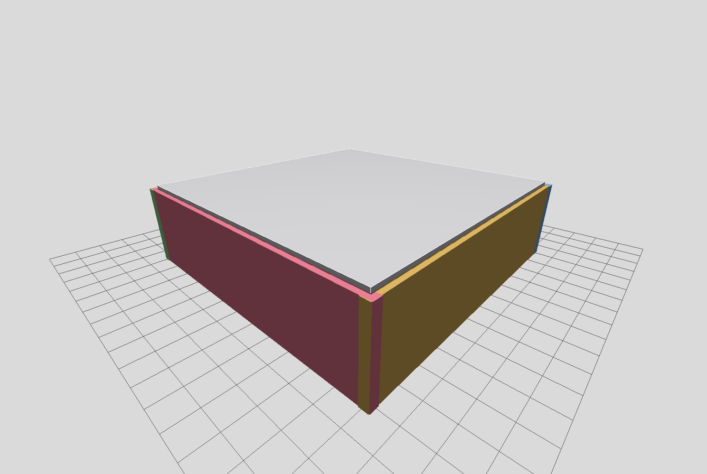
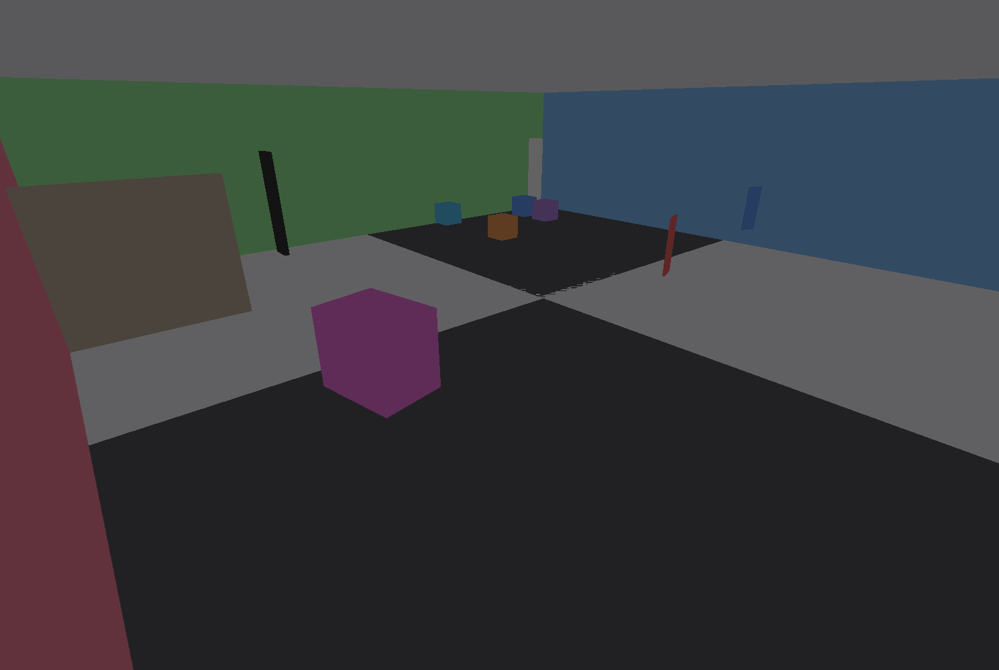
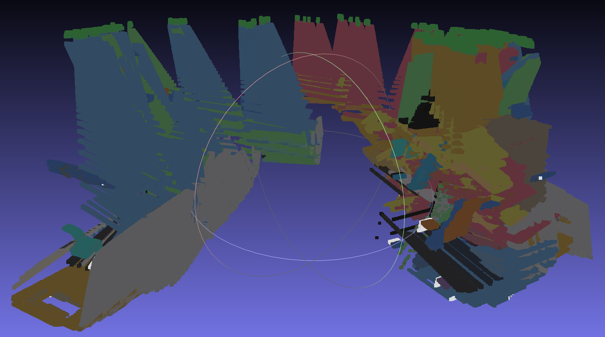
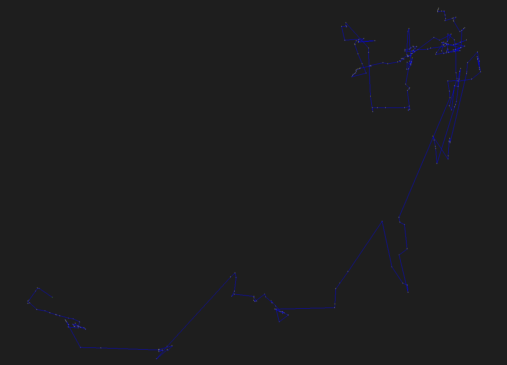
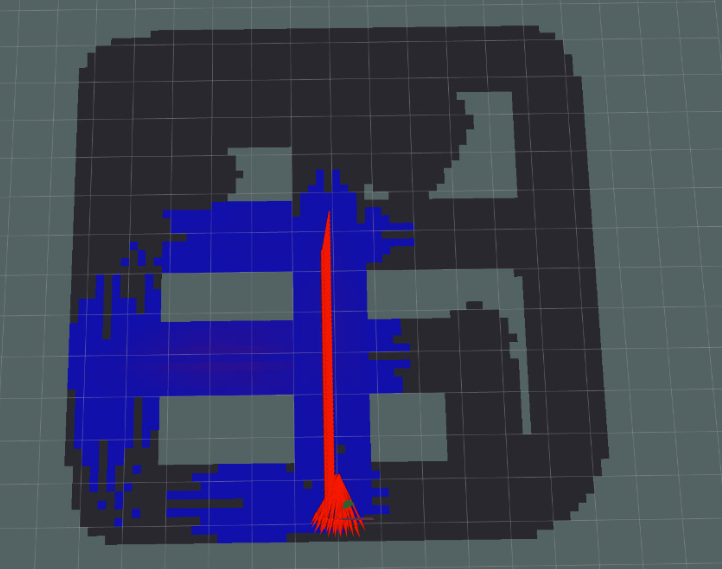

# SLAM-Based Autonomous Drone System for Environmental & Chemical Risk Detection

> A ROS 2 simulation of an autonomous indoor UAV that performs RGB-D SLAM, obstacle avoidance, and real-time gas concentration mapping.

---

## Overview

This project implements a fully simulated autonomous drone system capable of navigating an unknown indoor environment, building a 3D map using SLAM, and detecting simulated chemical/gas hazards. It was developed as a Senior Design Project (P2526-04) at Istanbul Bilgi University in partnership with Kayalar Kimya (Genç brand).

The system integrates multiple robotics subsystems — simulation, perception, mapping, navigation, and chemical sensing — into a single launchable pipeline using ROS 2 and Gazebo.

| Gazebo Environment (Outside) | Gazebo Environment (Inside) |
|:---:|:---:|
|  |  |

---

## Key Features

- **RGB-D Visual SLAM** using RTAB-Map for real-time 3D mapping and loop closure
- **Autonomous obstacle avoidance** with a finite-state machine controller
- **Simulated gas sensor** publishing concentration values using a Gaussian dispersion model
- **Chemical map visualization** overlaid on the environment in RViz
- **Fully integrated launch pipeline** — one command starts the entire system
- **Modular ROS 2 architecture** separating core logic from simulation bridging

---

## System Architecture

```
┌─────────────────────────────────────────────────────────┐
│                    full_system.launch.py                 │
├──────────────┬──────────────┬──────────────┬────────────┤
│   Gazebo     │   RTAB-Map   │  Avoidance   │    Gas     │
│  Harmonic    │     SLAM     │ Controller   │  Mapping   │
│              │              │              │            │
│ simple_drone │ RGB-D + Odom │  /cmd_vel    │/gas/conc.  │
│ RGB-D Camera │  Pose Graph  │  FSM States  │/gas/map    │
└──────────────┴──────────────┴──────────────┴────────────┘
                        │
                      RViz
          (RGB · Depth · PointCloud · TF
           RTAB Map · Gas Chemical Map)
```

### Components

| Component | Role |
|---|---|
| Gazebo Harmonic | Simulated indoor environment and UAV model |
| `simple_drone` | Custom UAV model with RGB-D camera |
| RTAB-Map | RGB-D SLAM, pose graph, loop closure |
| Obstacle Avoidance Controller | FSM-based depth-guided navigation |
| `gas_sensor_sim_node` | Gaussian gas concentration simulation |
| `chemical_mapper_node` | Builds and publishes the gas map |
| RViz | Full system visualization |

---

## Simulated UAV Specifications

| Property | Value |
|---|---|
| Model | `simple_drone` (custom research UAV) |
| Body size | 0.72 × 0.52 × 0.14 m |
| Mass | 1.2 kg |
| Camera | RGB-D, 640×480, 60° FOV |
| Depth range | 0.1 m – 10.0 m |
| Camera update rate | 10 Hz |
| Motion control | Velocity-controlled via `/cmd_vel` |
| TF chain | `odom → base_link → rgbd_camera` |

> The simulated platform is a custom simplified research UAV, not modeled after any specific commercial drone.

---

## Tech Stack

| Tool | Version | Purpose |
|---|---|---|
| ROS 2 | Jazzy | Middleware and node communication |
| Gazebo | Harmonic | Physics simulation |
| RTAB-Map | Latest | RGB-D SLAM |
| RViz | — | Visualization |
| Python | 3.x | Node logic |

---

## Repository Structure

```
slam-for-drone-using-RTAB/
├── drone_gas_core/          # Core ROS 2 package: SLAM, avoidance, gas nodes
├── drone_gas_sim_bridge/    # Simulation bridge: Gazebo ↔ ROS 2 interface
├── .gitignore
└── README.md
```

---

## Prerequisites

- Ubuntu 22.04 or 24.04
- ROS 2 Jazzy (desktop install)
- Gazebo Harmonic
- RTAB-Map ROS 2 package
- Python 3 with standard ROS 2 dependencies

---

## Installation

```bash
# Clone the repository into your ROS 2 workspace
cd ~/ros2_ws/src
git clone https://github.com/Dsv9/slam-for-drone-using-RTAB.git

# Build the workspace
cd ~/ros2_ws
source /opt/ros/jazzy/setup.bash
colcon build --symlink-install
source install/setup.bash
```

To rebuild only the core package after changes:

```bash
colcon build --symlink-install --packages-select drone_gas_core
source install/setup.bash
```

---

## Usage

### Launch the Full System

```bash
source /opt/ros/jazzy/setup.bash
source ~/ros2_ws/install/setup.bash

ros2 launch drone_gas_core full_system.launch.py \
  enable_avoidance:=true \
  enable_exploration:=false \
  demo_avoidance_mode:=true \
  enable_gas:=true
```

### Recommended Demo Launch (with debug output)

```bash
ros2 launch drone_gas_core full_system.launch.py \
  enable_avoidance:=true \
  enable_exploration:=false \
  demo_avoidance_mode:=true \
  enable_gas:=true \
  debug_gas:=true \
  debug_avoidance:=true \
  safe_distance_m:=0.38 \
  critical_distance_m:=0.22 \
  clear_distance_m:=0.60 \
  forward_speed_m_s:=0.08 \
  turn_speed_rad_s:=0.50
```

---

## Verification

```bash
# Check camera topics
ros2 topic hz /rgbd_camera/image
ros2 topic hz /rgbd_camera/depth_image
ros2 topic hz /rgbd_camera/points

# Check odometry and TF
ros2 topic echo /odom --once
ros2 run tf2_ros tf2_echo odom base_link

# Check gas sensor
ros2 topic hz /gas/concentration
ros2 topic echo /gas/concentration

# Open RTAB-Map database viewer
rtabmap-databaseViewer ~/.ros/rtabmap.db
```

---

## Gas Concentration Model

The gas sensor uses a **Gaussian dispersion model**:

$$C = A \cdot \exp\left(\frac{-d^2}{2\sigma^2}\right)$$

Where:
- `C` — concentration at the sensor position
- `A` — peak amplitude
- `d` — distance from the gas source
- `σ` — spatial spread parameter

The sensor publishes on `/gas/concentration` at ~5 Hz. The chemical map is built by `chemical_mapper_node` and published on `/gas/chemical_map`, visualized in RViz using the `costmap` color scheme.

---

## Visualization

| RTAB-Map 3D Point Cloud | Drone Trajectory (Pose Graph) |
|:---:|:---:|
|  |  |

| RViz — Gas Concentration Map |
|:---:|
|  |

---

## RViz Topics

| Display | Topic |
|---|---|
| RGB Image | `/rgbd_camera/image` |
| Depth Image | `/rgbd_camera/depth_image` |
| Point Cloud | `/rgbd_camera/points` |
| Odometry | `/odom` |
| RTAB Map | RTAB-Map plugin |
| Gas Map | `/gas/chemical_map` |

---

## Known Limitations

- The avoidance controller is demo-focused, not a full navigation planner
- The drone may struggle in very narrow or corner-trap environments
- Odometry is not always a perfect representation of Gazebo motion
- The gas sensor falls back to a default pose when valid odometry or RTAB localization is unavailable
- The RTAB-Map database (`.db`) can grow to several gigabytes during long sessions

---

## Project Context

This system was developed as part of **Senior Design Project P2526-04** at Istanbul Bilgi University, in collaboration with **Kayalar Kimya** (Genç brand) as the industry partner.

**Team:** Basil Mohammad A. Sadlah · Mehmet Ayberk Pişkin · Saleh Rami Yaish · Omar Zuhair Arafat · Mohammad S. M. Al-Hamami

**Supervisor:** Asst. Prof. Dr. Banu Kabakulak

---

## Future Work

- Port performance-critical nodes (avoidance, SLAM preprocessing) to C++ for real-time efficiency
- Integrate a full navigation planner (e.g. Nav2) to replace the FSM controller
- Validate the pipeline on physical hardware
- Extend gas modeling with multi-source and dynamic dispersion

---

## License

This project is part of an academic thesis. Please contact the authors before reuse or redistribution.
